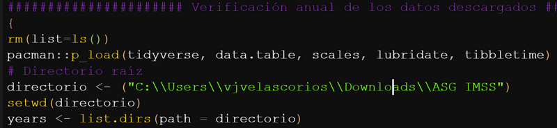
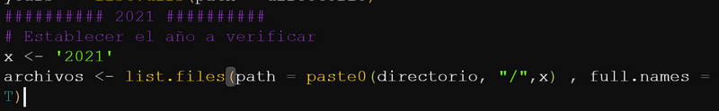
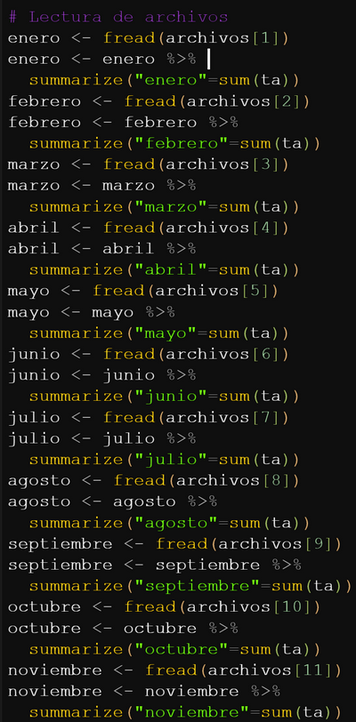
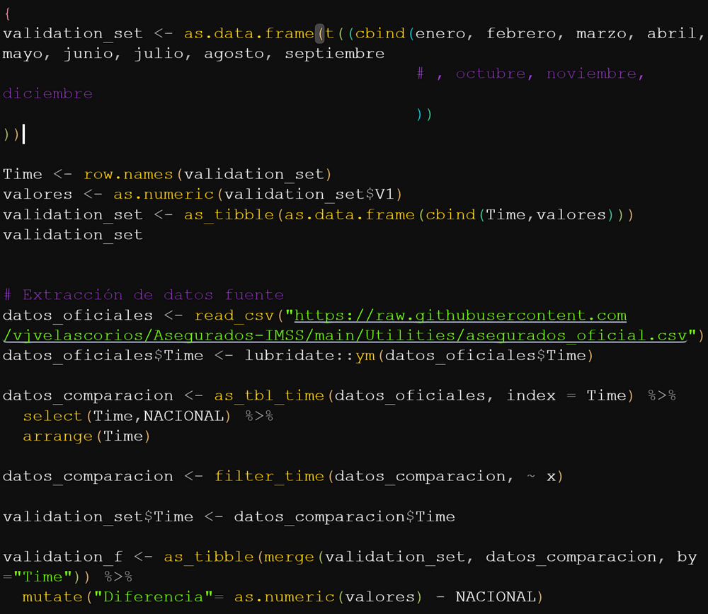
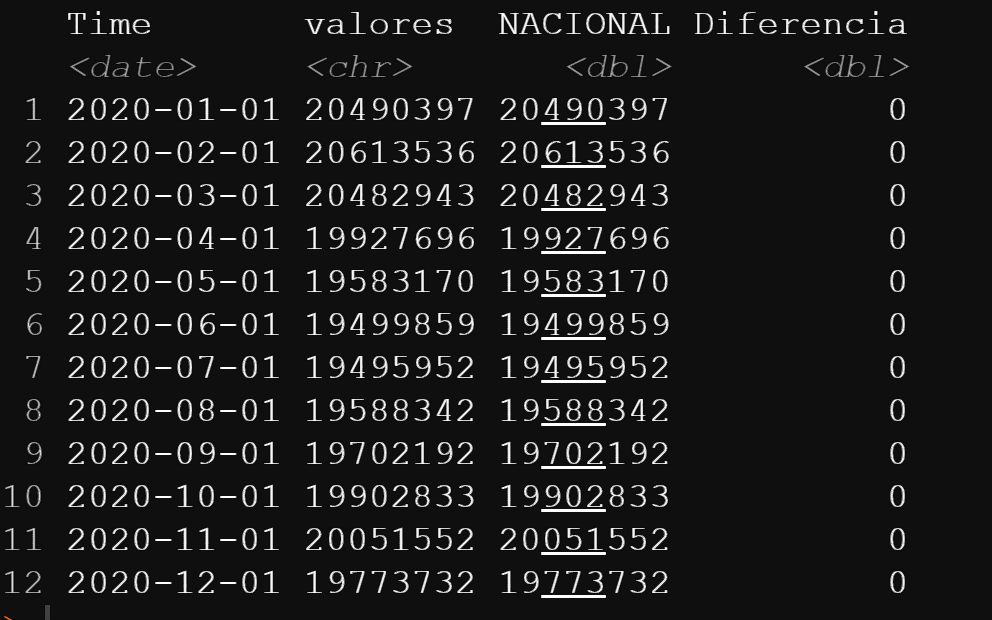
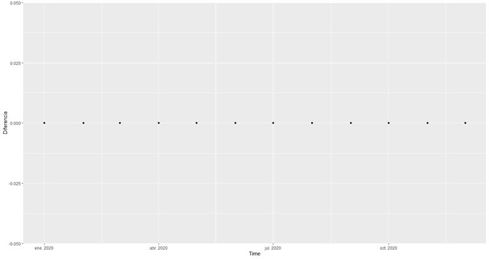

# Asegurados en el Instituto Mexicano del Seguro Social (1997-2021)

Automatización para  la descarga de datos correspondientes a los [asegurados](http://datos.imss.gob.mx/dataset) en el IMSS de 1997 al 2021.

El código se encuentra actualizado hasta diciembre del 2021 y actualmente descontinuado, sin embargo, como alternativa se presenta un código intuitivo para que el usuario pueda realizar modificaciones y extensiones por cuenta propia. Adicionalmente, se adjunta un pequeño ejemplo sobre el funcionamiento y descarga de los datos, así como el código para la verificación de la integridad de los datos.

## Cambios y actualizaciones

- 2023/04/01: Introducing a loop version (check `/Code/`) for data download.

- 2022/01/05: Actualización final a diciembre del 2021.

- 2021/10/26: Código para la verificación anual de los datos (ver subsección correspondiente).

- 2021/10/26: Actualización septiembre 2021.

- 2021/02/06: Código final al 2020 y ejemplo mínimo.

- 2021/01/22: Creación del repositorio.

## Funcionamiento del código
El código adjuntado en el repositorio permite correr el script de forma integral, cambiando únicamente el directorio de descarga de los archivos (debe ser grande debido al tamaño de cada archivo), sin embargo, se adjunta el siguiente ejemplo mínimo y se explican las partes centrales para la comprensión o modificación del código en funciones de las necesidades del usuario.

### 1. Establecer el directorio de descarga (debe ser amplio, debido a que se necesitarán más de 2 GB por año).
``` r
# Se cargan los paquetes necesarios y se establece el directorio de descarga de los datos:
pacman::p_load(downloader, tidyverse, RCurl, beepr, tictoc)
dir<-setwd("Z:/Datos/ASG IMSS/")
```

### 2. Se descarga y lee los datos con las direcciones de los distintos archivos a descargar (1997 hasta lo último disponible).
``` r
links<-read_csv(url("https://raw.githubusercontent.com/vjvelascorios/Asegurados-IMSS/main/Utilities/Tabla_direcciones.csv"))
```

### 3. Se realizan los ajustes previos para la descarga de los datos.
Nota: La variable *x* cambia en función del año que se quiera descargar.
``` r
x<- "1997"
links_mensuales<- links %>%
    filter(Year==x)%>%
    select(Year,Month,Final_link)
y_i<- x
m_i<-"01"
d_i<-"01"
dir.create(y_i,showWarnings = T)
year<-seq(as.Date( paste0(y_i,"/",m_i,"/",d_i) ), by = "month", length.out = 12)
asg<-"asg-"
estension<-".csv"
lista_general<-paste0(asg,year,estension)
dir_completa_de_guardado<-paste0(y_i,"/",lista_general)
dir_completa_de_guardado<-as.data.frame(dir_completa_de_guardado)
```
### 4. Descarga de los datos
``` r
    tic()
    download.file(url= as.character(links_mensuales[1,3]) ,destfile=dir_completa_de_guardado[1,1]  , method = "libcurl")
    download.file(url= as.character(links_mensuales[2,3]) ,destfile=dir_completa_de_guardado[2,1]  , method = "libcurl")
    download.file(url= as.character(links_mensuales[3,3]) ,destfile=dir_completa_de_guardado[3,1]  , method = "libcurl")
    download.file(url= as.character(links_mensuales[4,3]) ,destfile=dir_completa_de_guardado[4,1]  , method = "libcurl")
    download.file(url= as.character(links_mensuales[5,3]) ,destfile=dir_completa_de_guardado[5,1]  , method = "libcurl")
    download.file(url= as.character(links_mensuales[6,3]) ,destfile=dir_completa_de_guardado[6,1]  , method = "libcurl")
    download.file(url= as.character(links_mensuales[7,3]) ,destfile=dir_completa_de_guardado[7,1]  , method = "libcurl")
    download.file(url= as.character(links_mensuales[8,3]) ,destfile=dir_completa_de_guardado[8,1]  , method = "libcurl")
    download.file(url= as.character(links_mensuales[9,3]) ,destfile=dir_completa_de_guardado[9,1]  , method = "libcurl")
    download.file(url= as.character(links_mensuales[10,3]) ,destfile=dir_completa_de_guardado[10,1]  , method = "libcurl")
    download.file(url= as.character(links_mensuales[11,3]) ,destfile=dir_completa_de_guardado[11,1]  , method = "libcurl")
    download.file(url= as.character(links_mensuales[12,3]) ,destfile=dir_completa_de_guardado[12,1]  , method = "libcurl")
    toc()
    beep(sound = 3)
```

## Verificación anual de las bases de datos
Por la forma de descarga y no contar con una API, los archivos descargados pueden llegar a presentar inconsistencias o errores debido a: 

- archivos corruptos (conexión inestable o falta de potencia en la computadora).
- problemas de almacenamiento.
- falta de memoria ram.
- cambios en la dirección de descarga.

Debido a lo anterior, se sugiere realizar la verificación anual de los archivos descargados (archivo `verificacion_de_datos.R` en la carpeta "Code"), evaluando la sumatoria en el número de asegurados por mes.

A continuación se describe el funcionamiento básico del código y el resultado final de la verificación.

### 1. Directorio de los archivos descargados por año.
Se establece el directorio raíz de los archivos descargados y se leen los directorios anuales.



### 2. Se asigna el año a verificar



### 3. Se realiza la lectura de las bases de datos y se calcula el indicador mensual a verificar (el número total de asegurados).


### 4. Se crea un dataset de validación  uniendo los datos mensuales anteriores y se compara con la fuente oficial por medio del cálculo de diferencias de datos.



Una verificación anual correcta deberá dar como resultado las siguientes salidas, evidenciando que la diferencias de comparación son nulas.



- Los casos en los cuales es necesario cambiar un poco la codificación del archivo (crear el dataset de validación correcto) son aquellos años en los cuales no existen bases de datos de todos los meses en cuestión (1997, que va de agosto a diciembre) y donde no finaliza el año (2021, de enero a septiembre), por lo cual es necesario editar la linea 54 del código (creación del "validation_set").

Tal que para 1997:

`validation_set <- as.data.frame(t((cbind(agosto, septiembre, octubre, noviembre, diciembre))
))`

Y para 2021, el código sería el siguiente:

`validation_set <- as.data.frame(t((cbind(enero, febrero, marzo, abril, mayo, junio, julio, agosto, septiembre))
))`


- Para un correcto funcionamiento del código se recomienda tener por lo menos 4gb de RAM.

## Loop version y serialización

Se introdujo una versión del código la cual utiliza loops para la descarga de datos, tanto para años específicos, como para la totalidad de datos disponibles.


## Notas

1. La única estructura de código que cambia en relación al ejemplo mínimo es el correspondiente al 1997, debido a que solo existen datos publicados para los últimos cinco meses del año.

2. Los datos descargados tienen un corte al último día del mes (asegurados totales al final de mes), sin embargo, **por practicidad del código** la notación de los archivos **cambia al primer dia del mes**: "asg-2012-12-31" cambia a "asg-2012-12-01", manteniendo, por supuesto, el mismo periodo de corte (final del mes).


Cualquier duda o nota puedes colocarla en los issues del repositorio.
